# Hi there! 👋
My name is Harry, I'm 18, and I'm studying Computer Science at the University of Liverpool. In my free time, I contribute to open source projects, particularly revolving around Wii homebrew. I am also a developer on the [WiiLink](https://wiilink.ca) team, working to revive WiiConnect24 channels.

Feel free to contact me via email ([contact@harrywalker.uk](mailto:contact@harrywalker.uk)) or Discord (@shmiggity_shmack).

---

### Tech I'm familiar with

  

### Tech I'm interested in learning

  

---
 

  

